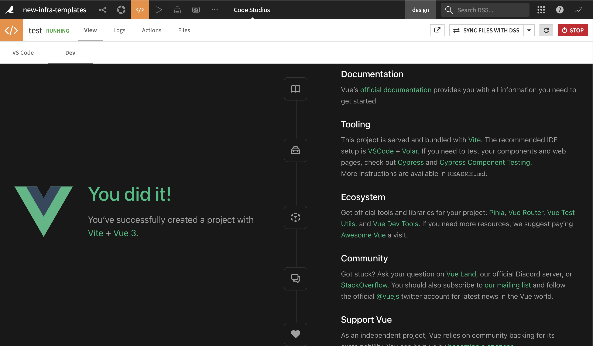
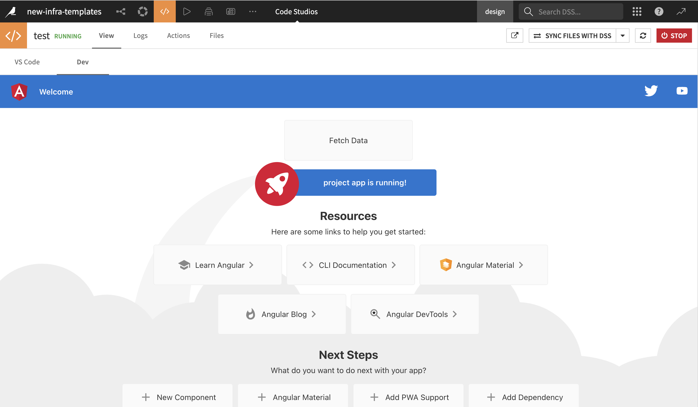

# Angular & vue code starters

```{admonition} Pre-requisites
:class: important

* Some familiarity with HTML, JavaScript and Angular or Vue for the front-end
* Some familiarity with Python for the backend
* [Code studio template](../template/index) set up on the Dataiku instance

```

This tutorial will guide you on how to set up a pre-configured Vue or Angular template for web application development. The primary goal of these templates is to expedite your start by quickly configuring the Node server to serve your code studio browser path and intercepting API requests to direct them to the exposed Flask backend.

The templates are designed in a way that also makes it easy to [deploy the application](../deployment/index) as a standard Dataiku DSS web application.

## Creating a new web application with cookiecutter

:::{topic} Note

- Cookiecutter is a command-line utility that rapidly generates projects from templates. In this context, we will utilize the Cookiecutter Python code environment specified in the Code Studio template
- All web application projects should be created within the **project-lib-versioned** folder. This practice allows you to synchronize the source code and built files with the Dataiku DSS project library, facilitating the application deployment process.
  :::

### Activation

To activate your Cookiecutter environment on the Visual Studio Code (VS Code) UI panel, execute the following command:

```
source /opt/dataiku/python-code-envs/cookiecutter/bin/activate
```

:::{topic} Note

- By default, all code environments defined in the Code Studio template are located in **/opt/dataiku/python-code-envs/**. If you have altered the code environment location in the template definition, ensure that you update the path accordingly.
  :::

### Command execution

- Navigate to the following directory:

  ```
  cd ~/workspace/project-lib-versioned/
  ```

- Then, run the following command to create a new template using Cookiecutter:

  ```
  cookiecutter gh:dataiku/solutions-contrib --checkout=feature/packaging
  ```

- You will be prompted to select the template you wish to create.

  ```
  [1/1] Select template
      1 - Angular (./bs-templates/angular)
      2 - BS (./bs-templates/bs)
      3 - Vue (./bs-templates/vue)
      Choose from [1/2/3] (1):
  ```

  - You need to choose one of the available templates by entering the corresponding number (1, 2, or 3).

- After choosing a template, you will be prompted to fill in the following parameters:

  ```
  [1/6] Choose your (Angular / Vue / Bs) project name (Angular Project): tutorial
  [2/6] version (0.0.1):
  [3/6] Choose your client serve port (default 4200) (4200):
  [4/6] Choose your flask backend port (default 5000) (5000):
  [5/6] dss_instance (default):
  [6/6] dku_project ():
  ```

  - "Choose your (Angular / Vue / Bs) project name" is asking for the name of your Angular project. In this example, it's set to "tutorial," but you can change it if you prefer a different name.
  - "version" is for specifying the version of your project.
  - "Choose your client serve port" is the port number on which the client (e.g., Angular) will serve. The default is 4200.
  - "Choose your Flask backend port" is the port number on which the Flask backend will run. The default is 5000.
  - "In the context of Code Studio within Dataiku, the parameters 'dss_instance' and 'dku_project' are primarily intended for use cases where the project template needs to be executed outside of Dataiku or locally. For Code Studio users, these parameters can typically be left empty, as they are not required for template customization within the Dataiku Code Studio environment."

- Once you fill in the parameters, a project folder with the project name slugified will be created in the directory **project-lib-versioned**

## Vue

The Vue template is an adaptation of the resulting template from [create-vue](https://github.com/vuejs/create-vue), it comes with a [Vite server](https://vitejs.dev/) configured to the right code studio base path, and an axios http client configured to forward requests to the exposed flask backend service.

### Running the frontend

- Start by navigating to your project folder (replace **\_\_PROJECT_NAME\_\_** with the name of your folder)

  ```
  cd ~/workspace/project-lib-versioned/__PROJECT_NAME__
  ```

- Install the dependencies by running

  ```
  yarn install
  ```

  :::{topic} Note
  npm, yarn and pnpm ae globally installed in the code studio template, you can choose any package manager to work with, just replace **yarn install** with **npm install** or **pnpm install**
  :::

- Run the frontend server

  ```
  yarn run dev
  ```

- View the web application on the Dev panel



### Running the backend

- Activate the backend code environment

  ```
  source /opt/dataiku/python-code-envs/infra37/bin/activate
  ```

  :::{topic} Note
  If you imported the code studio template, you will have an infra37 code env with the minimum requirements to launch the provided flask server in the template, the backend requires a **python >= 3.6** and the following packages

  ```
  Flask>=0.9
  git+https://github.com/dataiku/solutions-contrib.git@feature/packaging#egg=webaiku&subdirectory=bs-infra
  python-dotenv>=0.19.0
  dataiku-api-client
  ```

  :::

- Navigate to your project folder (replace **\_\_PROJECT_NAME\_\_** with the name of your folder)

  ```
  cd ~/workspace/project-lib-versioned/__PROJECT_NAME__
  ```

- Run the following command

  ```
  python -m backend.wsgi
  ```

## Angular

### Running the frontend

- Start by navigating to your project folder (replace **\_\_PROJECT_NAME\_\_** with the name of your folder)

  ```
  cd ~/workspace/project-lib-versioned/__PROJECT_NAME__
  ```

- Install the dependencies by running

  ```
  npm install
  ```

  :::{topic} Note
  npm, yarn and pnpm ae globally installed in the code studio template, you can choose any package manager to work with, just replace **yarn install** with **npm install** or **pnpm install**
  :::

- Run the frontend server

  ```
  npm start
  ```

- View the web application on the Dev panel



### Running the backend

- Activate the backend code environment

  ```
  source /opt/dataiku/python-code-envs/infra37/bin/activate
  ```

  :::{topic} Note
  If you imported the code studio template, you will have an infra37 code env with the minimum requirements to launch the provided flask server in the template, the backend requires a **python >= 3.6** and the following packages

  ```
  Flask>=0.9
  git+https://github.com/dataiku/solutions-contrib.git@feature/packaging#egg=webaiku&subdirectory=bs-infra
  python-dotenv>=0.19.0
  dataiku-api-client
  ```

  :::

- Navigate to your project folder (replace **\_\_PROJECT_NAME\_\_** with the name of your folder)

  ```
  cd ~/workspace/project-lib-versioned/__PROJECT_NAME__
  ```

- Run the following command

  ```
  python -m backend.wsgi
  ```
