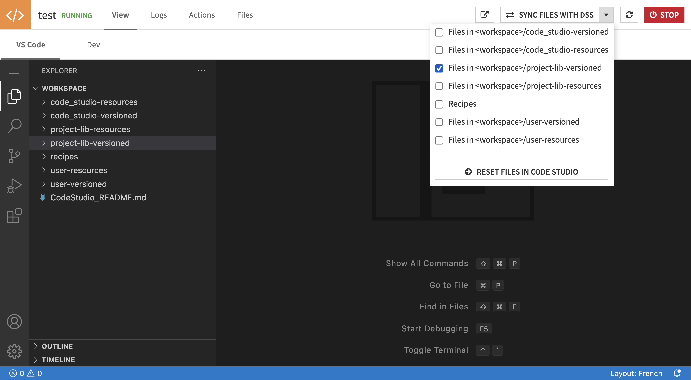
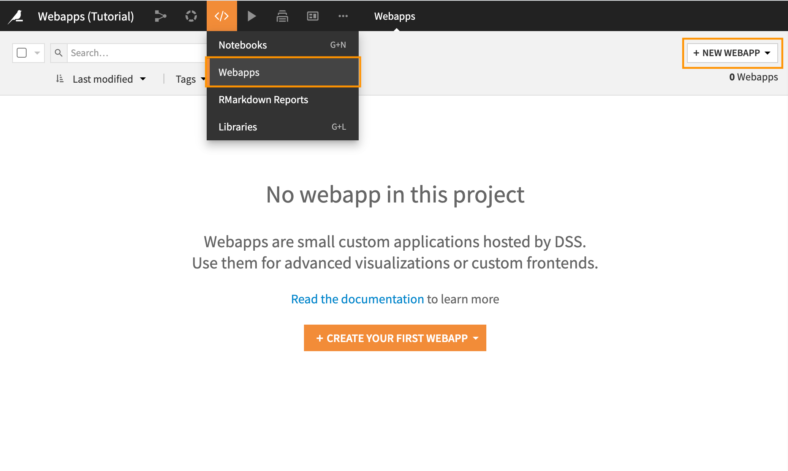
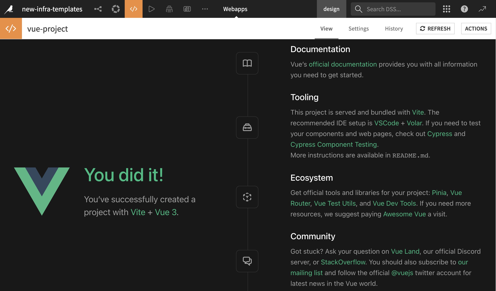

# Deploy your web application

In this section, you will learn how to deploy a web application developped with the code studio framework as a standard Dataiku DSS web application.

```{tip}

If you already deployed a web application, and want to update it, you can [Build the webapp](#step-1-building-the-application), [Sync the files](#step-2-sync-files-with-dataiku-dss) and restart you web application backend
```

## Step 1: Building the application

The first step is to build the web application in your code studio.

- Navigate to your project folder (replace **\_\_PROJECT_NAME\_\_** with the name of your folder)

  ```
  cd ~/workspace/project-lib-versioned/webapps/__PROJECT_NAME__
  ```

- Run (npm / yarn / pnpm) command to build the application

  ```
  yarn run build
  ```

  :::{topic} Note
  npm, yarn and pnpm ae globally installed in the code studio template, you can choose any package manager to work with, just replace **yarn run build** with **npm run build** or **pnpm run build**
  :::

- The built files will be created under **/workspace/project-lib-versioned/webapps/**PROJECT_NAME**/dist**

## Step 2: Sync files with Dataiku DSS

- Sync the files in your <workspace>/project-lib-versioned with DSS



## Step 3: Add webapps folder to the project python path

Adding webapps to your project python path allows you to import your custom flask bluprints and python modules.

- In the top navigation bar, go to Libraries.
- Edit the file **external-libraries.json** by adding webapps tp the "pythonPath"

  ```
  {
      "gitReferences": {},
      "pythonPath": [
          "python",
          "webapps"
      ],
      "rsrcPath": [
          "R"
      ],
      "importLibrariesFromProjects": []
  }
  ```

## Step 4: Create a new Stadard DSS web application

- In the top navigation bar, go to </> -> Webapps.

- Click on + New Webapp on the top right, then select Code Webapp > Standard.



- Remove the default code from the **CSS**, **HTML**, **JS** and **Python** tabs of your web application

## Step 5: Python backend

- In the Settings panel of your created web application, select the code environment for backend development

  :::{topic} Note

  - The python version of your code environment should be at least **>=3.6** .
  - The code environement should at least have these requirements and any other specific requirements you added for your backend

  Flask>=0.9
  git+https://github.com/dataiku/solutions-contrib.git@main#egg=webaiku&subdirectory=bs-infra
  dataiku-api-client
  :::

- Add the following code to your standard web application backend (replace {**\_\_YOUR_WEBAPPLICATION_FOLDER\_\_**} with the name of your web application folder)

  ```
  from flask import Flask
  from webaiku.extension import WEBAIKU
  from webapps.{__YOUR_WEBAPPLICATION_FOLDER__}.backend.fetch_api import fetch_api


  WEBAIKU(app, "webapps/{__YOUR_WEBAPPLICATION_FOLDER__}/dist")
  WEBAIKU.extend(app, [fetch_api])
  ```

  :::{topic} Note

  - In the provided example we import fetch_api as it is the default blueprint in the starter template, you can import any other blueprints or packages you added throughout the development
  - WEBAIKU is a wrapper around Flask app, it will extend the application to serve your static files from the flask server backend adress
    :::

## Step 6: JavaScript starter code

- In the JS tab of your web application, add the following code:

  ```
  const backendURL = dataiku.getWebAppBackendUrl('fetch/bs_init?URL='+getWebAppBackendUrl(''));
  window.onload = function() {
      var ifrm = document.createElement("iframe");
      ifrm.setAttribute("src", backendURL);
      ifrm.setAttribute("style", "position:fixed; top:0; left:0; bottom:0; right:0; width:100%; height:100%; border:none; margin:0; padding:0; overflow:hidden; z-index:999999;");
      document.body.appendChild(ifrm);
  }

  ```

  :::{topic} Note
  This code snippet creates a full-screen iframe, displaying content from Flask server backend URL. It waits for the page to load fully and then dynamically adds the iframe to the web page, making it cover the entire viewport.
  :::

Once you add the python and JS code snippets to your web application, you can view the deployed app.



## Next steps

Now that your webapp is finished, you can publish it on a [Dashboard](https://doc.dataiku.com/dss/latest/dashboards/index.html).

Here are the complete versions of the code presented in this tutorial:

```{dropdown} [JS Code](./assets/code.js)

:::{literalinclude} assets/code.js
:language: javascript
:::
```

```{dropdown} [Python Code](./assets/code.py)

:::{literalinclude} assets/code.py
:language: python
:::
```
