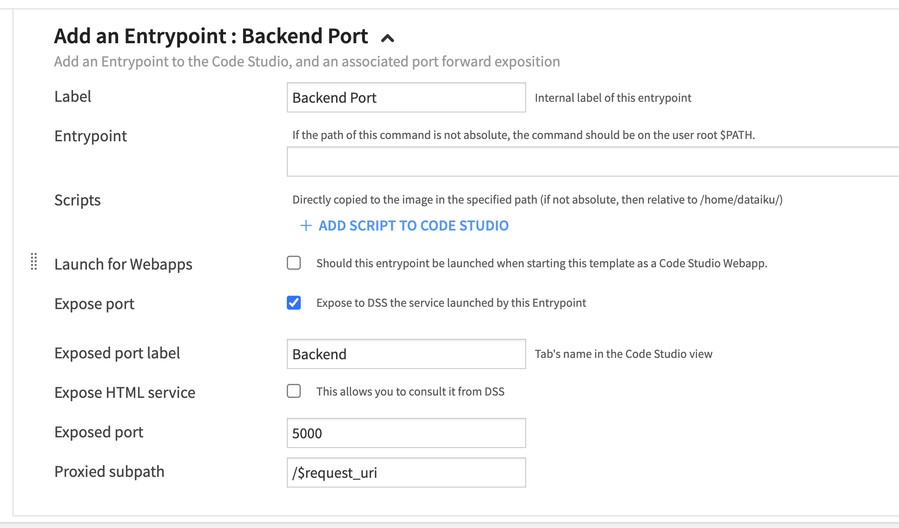
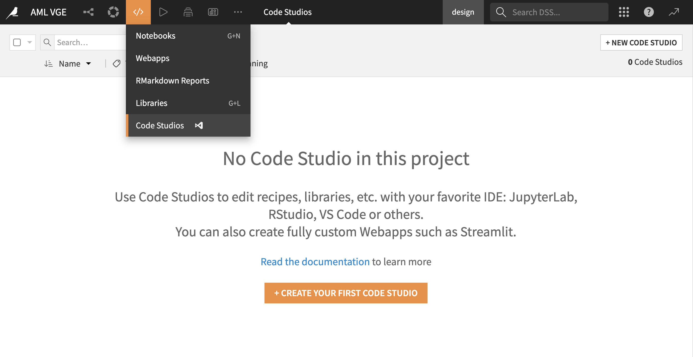

# Code studio template

````{admonition} Pre-requisites
:class: important

* Some familiarity with [Dataiku code studios](https://doc.dataiku.com/dss/latest/code-studios/index.html)
* Admin access to setup the code studio template
* Python >= 3.7 code environment with the package [cookiecutter >= 2.3.1](https://pypi.org/project/cookiecutter/) installed
* Python >= 3.6 code environment with the following packages for Flask backend development:

    ```
    Flask>=0.9
    git+https://github.com/dataiku/solutions-contrib.git@main#egg=webaiku&subdirectory=bs-infra
    python-dotenv>=0.19.0
    dataiku-api-client
    ```

````

In this tutorial you will learn how to setup a code studio template that will get you started on developping web applications with your favorite frontend framework, we currently support [Vue](https://vuejs.org/) & [Angular](https://angular.io/).

:::{topic} Note
_This setup should only be done one time. Once the template is available on your instance, it can be reused by any Dataiku DSS project for web applications development_
:::

## Importing the template

- Download the following [code studio template](https://github.com/dataiku/solutions-contrib/raw/feature/packaging/code-studio/dss_code_studio_template_infra.zip)

- Click on "Upload a Code Studio template" in the code studios admin panel.
- Import the downloaded template


- Please note that after creating the template, you can remap the provided Cookiecutter and infra37 code environment blocks to match the names of the code environments you've set up for cookiecutter and Flask backend development.


## Manual setup

This section provides instructions for manually configuring the Code Studio template without the need for downloading it. It also offers an explanation of the various blocks that make up the template.

- Click on _+ Create code studio template_ on the top right, once the template created go to the definition panel to start adding / editing [building blocks](https://doc.dataiku.com/dss/latest/code-studios/code-studio-templates.html#building-blocks)

- **[File synchronization](https://doc.dataiku.com/dss/latest/code-studios/code-studio-templates.html#file-synchronization)**: Exclude patterns like _node_modules/ , .angular, **pycache**_ and other patterns you deem convenient to exclude from the file synchronization between DSS instance and the Code studio.

- **[Kubernetes Parameters](https://doc.dataiku.com/dss/latest/code-studios/code-studio-templates.html#kubernetes-parameters)**

- Add a **[Visual Studio Code](https://doc.dataiku.com/dss/latest/code-studios/code-studio-templates.html#visual-studio-code)** block (It is not usually needed to change any setting of this block.)

- Add an **[Append to Dockerfile](https://doc.dataiku.com/dss/latest/code-studios/code-studio-templates.html#append-to-dockerfile)** block with the following Dockerfile content:

  ```
  USER root

  RUN yum install -y nodejs npm wget && \
      mkdir -p /usr/local/lib/node_modules && \
      chown dataiku:dataiku -R /usr/local/lib/node_modules && \
      npm install npm@7 -g && \
      npm install pnpm -g && \
      npm install yarn -g && \
      npm install @angular/cli -g

  RUN yum -y remove git && \
      yum -y remove git-* && \
      yum -y install https://packages.endpointdev.com/rhel/7/os/x86_64/endpoint-repo.x86_64.rpm && \
      yum -y install git

  RUN cd /opt/dataiku/code-server/lib/vscode/extensions && \
      npm init -y && \
      npm i typescript
  ```

  :::{topic} Note

  - This block installs globally npm, yarn and pnpm package managers along with angular cli
  - It updates git to its latest version
  - It installs typescript on vs code extensions for better linting and intelliSense
    :::

- **[Add an Entrypoint](https://doc.dataiku.com/dss/latest/code-studios/code-studio-templates.html#add-an-entry-point)** and expose the HTML service to make the frontend accessible from the Code Studio UI when launching your web application client server. Use /$request_uri for the proxied subpath.

  

- **[Add an Entrypoint](https://doc.dataiku.com/dss/latest/code-studios/code-studio-templates.html#add-an-entry-point)** for the web application flask backend, this will make the server accessible by requesting its URL directly. Use /$request_uri for the proxied subpath.

  :::{topic} Note
  _You don't need to expose the html service for this entry point_
  :::

  

- **[Add code environments](https://doc.dataiku.com/dss/latest/code-studios/code-studio-templates.html#add-a-code-environment)**: Add the two code environments you created for cookiecutter and Flask backend development.

## Using the template

- In the top navigation bar, go to </> -> Code Studios.
- Click on + New Code Studio on the top right, then select the newly created template > Create.
- Start the code studio


